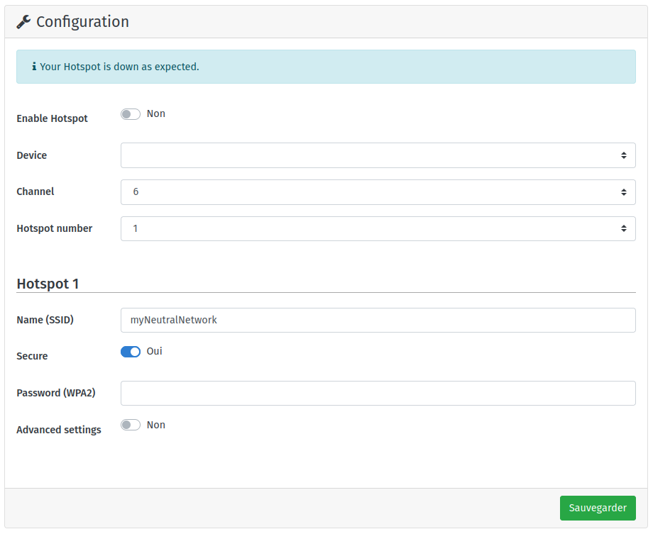

<!--
Nota bene : ce README est automatiquement généré par <https://github.com/YunoHost/apps/tree/master/tools/readme_generator>
Il NE doit PAS être modifié à la main.
-->

# Wifi Hotspot pour YunoHost

[](https://dash.yunohost.org/appci/app/hotspot)  

[](https://install-app.yunohost.org/?app=hotspot)

*[Lire le README dans d'autres langues.](./ALL_README.md)*

> *Ce package vous permet d’installer Wifi Hotspot rapidement et simplement sur un serveur YunoHost.*  
> *Si vous n’avez pas YunoHost, consultez [ce guide](https://yunohost.org/install) pour savoir comment l’installer et en profiter.*

## Vue d’ensemble

* Diffusez un point d'accès Wi-Fi depuis votre serveur auto-hébergé
* À combiner avec l'[app VPN Client](https://github.com/labriqueinternet/vpnclient_ynh) pour obtenir un accès internet aumatiquement protégé par votre VPN


**Version incluse :** 2.3.1~ynh1

## Captures d’écran



## Documentations et ressources

- Site officiel de l’app : <https://internetcu.be/>
- YunoHost Store : <https://apps.yunohost.org/app/hotspot>
- Signaler un bug : <https://github.com/YunoHost-Apps/hotspot_ynh/issues>

## Informations pour les développeurs

Merci de faire vos pull request sur la [branche `testing`](https://github.com/YunoHost-Apps/hotspot_ynh/tree/testing).

Pour essayer la branche `testing`, procédez comme suit :

```bash
sudo yunohost app install https://github.com/YunoHost-Apps/hotspot_ynh/tree/testing --debug
ou
sudo yunohost app upgrade hotspot -u https://github.com/YunoHost-Apps/hotspot_ynh/tree/testing --debug
```

**Plus d’infos sur le packaging d’applications :** <https://yunohost.org/packaging_apps>
